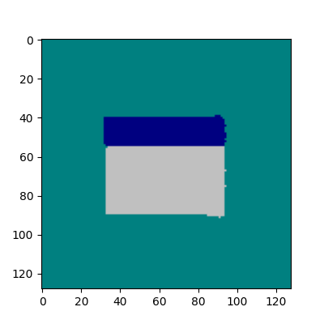

# NeuralOS

**moving windows without programming an event system, just a neural network guessing pixels from mouse actions**

[live demo](https://lusob.github.io/neural-os/) · [colab](https://colab.research.google.com/drive/1wrc67GjQErvWOsWSwoWndiKf-Wx-EZpz) · [Neural Computers paper (Meta, 2026)](https://arxiv.org/abs/2604.06425)



## how it works

two tiny neural networks running in your browser via [ONNX Runtime Web](https://onnxruntime.ai/docs/tutorials/web/). no server, no physics engine, no event system.

### the model: SplitGenie

a two-headed MLP (~39KB) with separate hemispheres for moving and resizing:

```
input: [dist_to_header_x, dist_to_header_y, dist_to_grip_x, dist_to_grip_y, click]  ->  5 floats

  MOVE hemisphere:   Linear(3->64) -> ReLU -> Linear(64->64) -> ReLU -> Linear(64->2) -> Tanh
                     input: [dist_header_x, dist_header_y, click]
                     output: [vel_x, vel_y]

  RESIZE hemisphere: Linear(3->64) -> ReLU -> Linear(64->64) -> ReLU -> Linear(64->2) -> Tanh
                     input: [dist_grip_x, dist_grip_y, click]
                     output: [delta_w, delta_h]
```

the two heads share nothing except the click signal, so the model cant confuse dragging with resizing.

### training data

40,000 synthetic examples generated analytically:
- move fires when cursor is within `HEADER_TOLERANCE=0.25` of the titlebar center
- resize fires when cursor is within `GRIP_TOLERANCE=0.15` of the corner grip
- resize takes priority over move when both zones overlap
- loss: MSE, trained with Adam for 10 epochs

no real interaction recorded, the behavior is learned purely from the geometry of the zones.

### what the side panel shows

- **DIST HEADER / DIST GRIP**: radar showing cursor distance to each interaction zone
- **Neural Activity**: activations of the last hidden layer of each hemisphere (green = move, orange = resize)
- **Motor Output**: raw network output, velocity and resize deltas before being applied to window state

### the interesting part

theres no `if/else` for "are we dragging or resizing". the network learned the decision boundary from examples. you can feel it near the edges, when the cursor is between the titlebar and the grip corner the network's uncertainty is visible as the window hesitates between modes.

## run it yourself

open the [colab notebook](https://colab.research.google.com/drive/1wrc67GjQErvWOsWSwoWndiKf-Wx-EZpz) to retrain the model from scratch. takes ~2 minutes on a free GPU.

## related

Meta AI published [Neural Computers](https://arxiv.org/abs/2604.06425) (Zhuge et al., 2026), same idea scaled up: a video model that predicts full screen frames conditioned on pixels + instructions + user actions, for both CLI and GUI. their open problems ("challenges remain with routine reuse, controlled updates, and symbolic stability") are the same walls this experiment hits.
